# MSP Buyer Intelligence architecture map

Status: MBI-1 implementation contract

Parent issue: #423

Implementation issue: #424
Last verified: 2026-08-11

## Decision

MSP Buyer Intelligence is a projection over the existing GEO-Pulse monolith. It is not a new
service, raw measurement store, report queue, renderer family, CRM, or agent. The only new domain
contract in MBI-1 is `buyer-intelligence-snapshot-v1`; the only new integration boundary is the
provider-neutral CRM contract.

The audit payload remains the complete site-diagnostic baseline. The agency snapshot remains the
current authoritative answer-engine report snapshot until MBI-4 migrates its consumers to the buyer
intelligence projection. Neither source is copied into a third raw store.

## Intended dependency direction

```mermaid
flowchart LR
  A["Organization Context"] --> B["Runs, evidence and quality"]
  B --> C["Deep audit and benchmark authorities"]
  C --> D["Buyer intelligence projector"]
  D --> E["Immutable buyer intelligence snapshot"]
  E --> F["Preview, baseline, monthly and portfolio views"]
  F --> G["Existing report QA, queue, storage and attribution"]
  H["CRM provider adapter"] --> I["Provider-neutral CRM contract"]
  I --> J["Generation application service"]
  J --> D
  G --> K["Approved report sync projection"]
  K --> H
```

Allowed dependency direction is inward: provider adapters depend on CRM contracts; application
services depend on domain contracts; domain contracts never depend on provider, server, worker, UI,
or renderer implementations.

## Current authority inventory

| Area | Classification | Current authority | Decision |
| --- | --- | --- | --- |
| Organization identity and market | authoritative | `lib/intelligence/organization-context.ts` and `organization-measurement-context.ts` | Reuse immutable context version/hash and fail closed on conflicts. |
| Domain/page identity | authoritative | migrations `059_intelligence_identity.sql` and identity repositories | Reference canonical IDs; never join reports by a display name. |
| Run lineage | authoritative | `lib/intelligence/run-index.ts`, migration `061_intelligence_run_index.sql` | Snapshot references compatible run IDs; it does not copy provider output. |
| Evidence | authoritative | `lib/intelligence/evidence.ts`, migration `062_intelligence_evidence_catalog.sql` | Snapshot stores evidence IDs and bounded summaries only. |
| Quality and quarantine | authoritative | `lib/intelligence/quality-policy.ts`, migration `063_intelligence_quality_policy.sql` | Only eligible evidence influences reports and benchmarks. |
| Intelligence marts | authoritative read model | migration `064_intelligence_analytical_marts.sql` | Project compatible observations; do not add another warehouse. |
| Deep site audit | authoritative baseline input | `workers/report/deep-audit-report-payload.ts` | Preserve its canonical PDF/Markdown source role. Adapt into observations in MBI-2. |
| Deep-audit rendering | adapter | `build-deep-audit-pdf.ts` and `build-deep-audit-markdown.ts` | Continue until MBI-4 places all product views behind the shared view contract. |
| Answer-engine agency report | authoritative current report | `lib/server/agency-report-snapshot.ts` plus `lib/intelligence/agency-report-integrity.ts` | Use as the compatibility source for MBI-3; do not fork its integrity rules. |
| Agency report artifact | authoritative current artifact | `agency-report-store.ts`, `agency-report-pdf.ts`, `load-agency-report-snapshot.ts` | MBI-4 migrates exact preview/download/email consumers before retirement decisions. |
| Report QA | authoritative | `workers/report/report-qa-gate.ts` | Extend; never introduce a second customer-boundary validator. |
| Deep report queue | authoritative | `workers/queue/report-queue-consumer.ts` and `lib/queue/report-job.ts` | Generation requests enter through an application adapter; CRM providers never call it directly. |
| Report object storage | authoritative | `workers/report/r2-report-storage.ts` | Signed application routes remain the access boundary, not raw object URLs. |
| Branding/settings | authoritative | `report-branding-settings.ts`, `report-settings.ts`, `resolve-report-brand.ts` | Partner branding and CTA extend sparse inheritance; no provider-owned branding. |
| Recurring site audit | authoritative schedule | `lib/server/recurring-audits.ts`, migration `051_recurring_audits.sql` | MBI-9 composes compatible audit and benchmark schedules; no second scheduler. |
| Lifecycle email | authoritative notification control | `lib/server/lifecycle-email.ts`, migration `083_lifecycle_email_control_plane.sql` | Reuse exceptions/retries; CRM campaign sending stays with the partner CRM. |
| Report engagement | authoritative attribution | `app/api/attribution/report-view/route.ts`, `report-attribution-beacon.tsx`, migration `079_agency_report_v2.sql` | Count deliberate client actions separately from server requests and image loads. |
| Social distribution OAuth | authoritative for social only | `distribution-engine-repository.ts`, `distribution-token-crypto.ts`, migration `020_distribution_engine_foundation.sql` | Do not reuse as CRM storage: its provider constraints and publishing semantics are incompatible. |
| Startup Slack/GitHub connectors | adapter examples | `app/dashboard/connectors/*`, startup integration modules | Reuse UI/status patterns only; do not couple CRM state to startup provisioning. |

## Compatibility and retirement inventory

| Path | Current reason it exists | Target |
| --- | --- | --- |
| `agencySnapshotToGpmPayload` in `agency-report-snapshot.ts` | Converts snapshot v2 back into the older GPM delivery payload. | Retire in MBI-4 after schedule/email/preview consumers accept the canonical view projection. |
| `geo-performance-report-payload.ts` | Older per-engine/combined presentation payload. | Compatibility-only in MBI-3; retire or reduce to an external adapter in MBI-4/10. |
| `geo-performance-report-pdf.ts` and `geo-performance-report-store.ts` | Legacy GPM artifact path. | Route every active consumer to the exact canonical renderer, then remove in MBI-4/10. |
| `report-preview-payload.ts` | Directly queries latest scans and benchmark metrics for a settings preview. | Retire in MBI-4. It is an approximate second projection and can invent zero-like combined values for unmeasured engines. |
| `organization-context-capabilities.ts` preview fallback | Calls the approximate preview when no exact report exists. | Replace with snapshot eligibility/explicit empty state in MBI-4. |
| `visibility-report.ts` and its `monitor-subscription.ts` consumer | Builds a separate lightweight visibility summary for monitoring email. | Replace with the monthly view from the canonical snapshot in MBI-9; retire in MBI-10. |
| `geo-performance-schedule.ts` conversion call | Delivers the older payload from a stored agency snapshot. | Move to canonical view delivery in MBI-4; remove conversion after compatibility window. |

Compatibility code is not deleted until its consumers are migrated, affected tests pass, production
browser/PDF evidence is fresh, and rollback is preserved. New features must not add consumers to a
path listed for retirement.

## Buyer intelligence snapshot boundary

`lib/intelligence/buyer-intelligence-contract.ts` defines the immutable projection. It contains:

- organization identity, confirmed context version/hash, market, owner and period;
- versioned query set, evaluator, quality policy, provider availability and run lineage;
- buyer-question observations with evidence, confidence and collection time;
- an eligible versioned benchmark with a positive disclosed denominator, or an explicit
  `not_available` state with null denominator fields;
- recommendations tied to observations/evidence and a versioned verification rule;
- comparable change only when a prior snapshot exists;
- report eligibility/quarantine reasons, limitations and complete provenance.

The schema rejects mixed context versions, undeclared evidence/runs, unversioned cohorts, zero
denominators masquerading as unavailable data, unconfirmed report-eligible contexts, and undeclared
raw provider fields. The snapshot is a customer/report contract; raw content remains in the evidence
catalog and source systems.

## CRM boundary

`lib/connectors/crm-contract.ts` defines five pure contracts:

1. `ConnectorAccount`: tenant, provider identity, scopes, status and a credential reference. It never
   contains token material.
2. `ContactProjection`: provider/contact/list IDs and the minimum name, company, domain, optional
   email and suppression fields needed for selection and report mapping.
3. `GenerationRequest`: connector, contact, sponsor and report-owner tenant references, report view,
   idempotency, state, attempts and cap decision. All tenant references must match.
4. `ReportSyncProjection`: only approved report URLs, thumbnail, score/summary and lifecycle fields
   written back to the CRM.
5. `ProviderEvent`: normalized event identity, replay key, payload hash and minimum object reference.
   Raw webhook payloads are not part of the durable contract.

Brevo and later HubSpot adapters may translate provider requests and responses into these contracts.
They cannot import renderer/build modules or own snapshot construction. The application layer will
orchestrate connector repository, eligibility, queue, snapshot, report QA and sync in MBI-5/6.

## Strangler sequence

1. **MBI-2:** project quality-eligible deep-audit and benchmark evidence into observations and cohort
   comparisons. No renderer consumer changes.
2. **MBI-3:** assemble and persist/reference the canonical snapshot plus recommendation verification.
   Keep agency snapshot v2 as a compatibility input.
3. **MBI-4:** make preview, baseline, monthly and portfolio views consume one snapshot/view contract;
   migrate exact web/PDF/email consumers and stop new legacy payload consumers.
4. **MBI-5:** add tenant/sponsor UI and application-level generation orchestration using a fake CRM
   adapter. Reuse report queue, QA, storage and attribution.
5. **MBI-6/7:** add the thin Brevo adapter and founder canary. No provider-specific report logic.
6. **MBI-9:** use the existing recurring schedule/lifecycle control to generate comparable monthly
   snapshots and verify recommendations.
7. **MBI-10:** delete migrated compatibility paths, reduce touched oversized orchestrators, verify
   operating cost/recovery, and update this map.

## Test and review gates

- Contract schemas and synthetic fixtures cover context, denominator, provenance, tenant and raw
  payload failures.
- Import-boundary tests keep intelligence independent of connectors and provider adapters independent
  of snapshot/rendering implementations.
- Each later issue adds characterization tests before moving a consumer.
- No private contact, token, signed report URL or customer payload enters a committed fixture.
- Every customer-facing migration receives exact browser/PDF/email comparison and independent review.
- A PR must name source modules added/removed, net production lines, dependencies, environment
  variables, migrations and manual operator steps.

## MBI-1 production effect

None. MBI-1 adds pure schemas, architecture tests and this map. It does not add a migration, provider,
environment variable, queue, scheduler, report output, database write, customer action or external
communication.
